> 🇰🇷 한국어 | [🇻🇳 Tiếng Việt](README.md)

# Company Scanner

IT 아웃소싱 영업을 위해 실제 웹사이트에서 기업 정보를 수집하는 도구입니다.

URL을 입력하면 앱이 실제로 해당 웹사이트에 접속해 회사 소개·연락처·경영진·채용
페이지를 크롤링하고 영업에 필요한 정보를 추출합니다. 가짜 데이터(mock data)는
없습니다. URL마다 독립적으로 스캔하며, 찾지 못한 항목은 `찾을 수 없음`으로 표시합니다.

## 기능 소개

아래 이미지는 앱의 실제 화면이며, 데이터는 `scatterlab.co.kr`을 실제로 스캔한
결과입니다. CRM 이미지(12–15)는 실제 스캔한 기업에서 만든 리드이며, 예산·상태·일정은
파이프라인 설명을 위해 영업 담당자가 직접 입력한 값입니다.
`python backend/take_screenshots.py`로 다시 캡처할 수 있습니다.

### 1. URL 입력, 실제 웹사이트 스캔

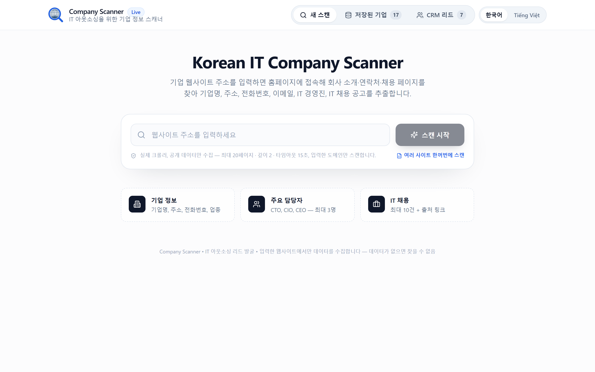

한국 기업 웹사이트 주소를 붙여넣고 **스캔 시작**을 누르세요. 앱은 실제 웹사이트에
접속하며 샘플 데이터나 대체 데이터를 쓰지 않습니다 — URL마다 독립적인 스캔입니다.
기본 언어는 한국어이고, 오른쪽 상단 버튼으로 베트남어로 전환할 수 있습니다.

### 2. 크롤러의 실제 진행 상황을 그대로 표시

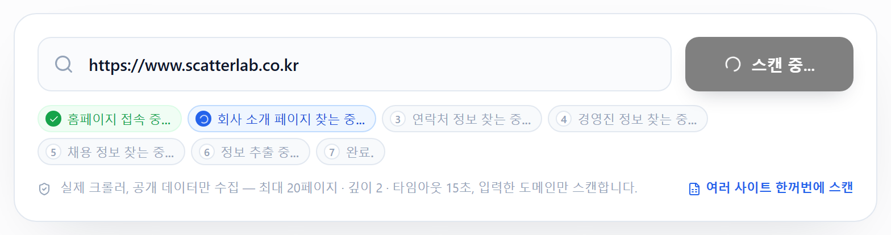

홈페이지 접속 → 회사 소개 → 연락처 → 경영진 → 채용 → 정보 추출 → 완료의 7단계.
크롤러가 단계를 넘어갈 때마다 서버가 Server-Sent Events로 상태를 보내므로, 시간에
맞춰 흘러가는 효과가 아니라 실제 진행 상황입니다.

### 2b. 여러 사이트 한꺼번에 스캔

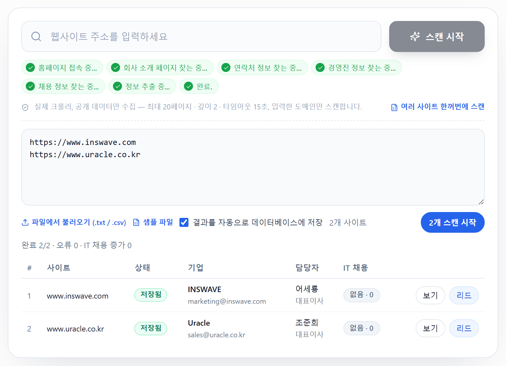

입력창 아래 **여러 사이트 한꺼번에 스캔**을 누르고 주소 목록을 붙여넣으세요(한 줄에
하나 — Excel, 메모장, 카카오톡에서 복사해도 되고 쉼표·공백으로 구분해도 됩니다). `.txt`
/ `.csv` 파일을 불러올 수도 있으며(어느 열이든 웹사이트처럼 보이는 값을 모두 추출,
**샘플 파일** 제공), 최대 50개, 중복은 자동 제거됩니다. 단일 스캔과 같은 크롤러로
**순차** 스캔하고 결과마다 **데이터베이스에 자동 저장**(▲/▼ 이력 기록)하며, 아래 표가
한 줄씩 갱신됩니다: 상태, 기업명, 담당자, IT 채용, 상세를 여는 **보기**, CRM으로 바로
보내는 **리드**. 실패한 사이트는 이유를 표시하고 나머지는 계속 진행하며, **중지**로
중간에 멈출 수 있습니다.

### 3. 기업 정보와 주요 담당자, 항목마다 출처 표시

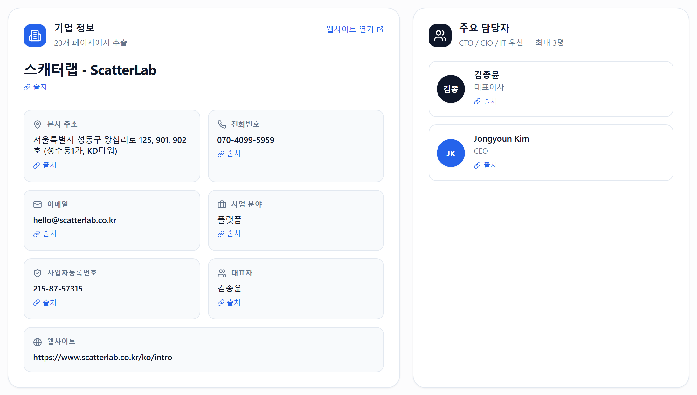

기업명, 본사 주소, 전화번호, 이메일, 사업 분야, **사업자등록번호**, **대표자** — 각
항목에 해당 정보가 있는 페이지로 연결되는 **출처** 링크가 붙어 있어 영업 담당자가
연락 전에 확인할 수 있습니다. 마지막 두 항목은 푸터에서 가져옵니다. 전자상거래법상
한국 웹사이트는 푸터에 사업자등록번호와 대표자를 표기해야 하므로 거의 모든 사이트에
있습니다. 찾은 대표자는 주요 담당자에 자리가 남아 있으면 자동으로 추가됩니다.
오른쪽은 IT 의사결정에 관여하는 담당자 최대 3명으로, CTO → CIO → IT/개발 책임자 →
CEO 순으로 우선합니다. 데이터가 없으면 `찾을 수 없음`으로 표시하고, 추측하거나 다른
회사 정보로 채우지 않습니다.

### 4. IT 채용 공고와 IT 채용 신호

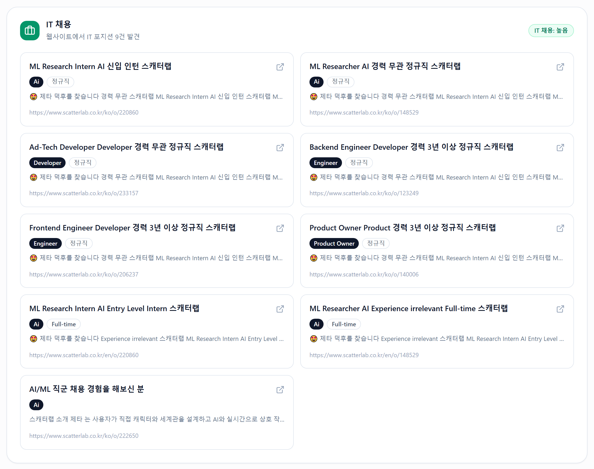

IT/소프트웨어 직무만 최대 10건 수집하며 영업, 회계, 인사는 제외합니다. 각 공고에는
직무, 고용 형태, 마감일, 채용 페이지 링크가 있습니다. 오른쪽 상단의 **IT 채용**
신호는 5건 이상 → 높음, 2–4건 → 보통, 1건 → 낮음, 0건 → 없음 — IT 인력을 많이 뽑는
회사가 곧 인력이 필요한 회사입니다.

### 5. 데이터 출처 — 모든 값에 근거가 있습니다

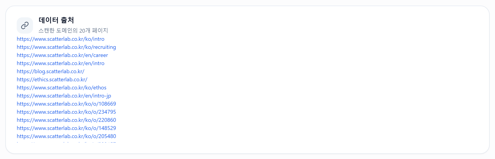

크롤링한 전체 페이지 목록이며 모두 입력한 도메인에 속합니다. 블로그나 외부 채용
포털 등 다른 도메인 링크는 다른 회사의 데이터가 섞이지 않도록 제외합니다.

### 6. 구조화된 JSON

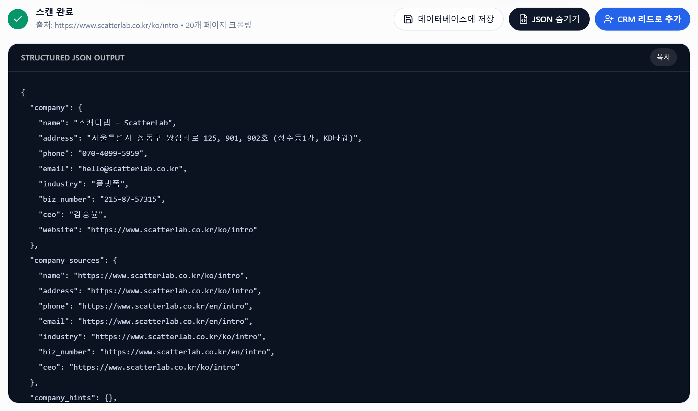

**JSON 보기**를 누르면 API가 반환하는 구조 그대로 확인하고 복사할 수 있습니다.
결과를 다른 시스템에 넣을 때 사용합니다.

### 7. 데이터베이스 저장

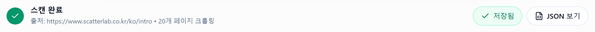

**데이터베이스에 저장** 버튼 하나면 됩니다. 도메인을 키로 쓰기 때문에 같은 웹사이트를
다시 스캔하면 중복 행이 생기지 않고 기존 행이 갱신됩니다.

### 8. 저장된 기업 목록

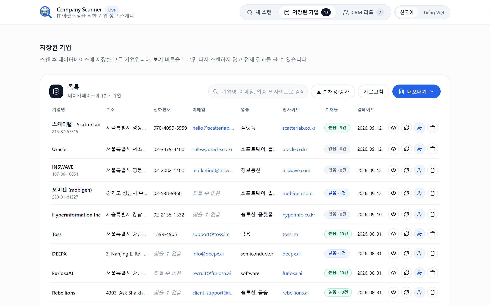

별도 페이지 `/saved`에서 저장된 모든 기업을 기업명, 주소, 전화번호, 이메일, 업종,
웹사이트, IT 채용(건수 포함), 업데이트 날짜와 함께 보여줍니다. 행(또는 눈 아이콘)을
누르면 다시 스캔하지 않고 전체 결과를 열고, ↻는 해당 기업을 바로 **재스캔**하며,
휴지통은 확인 후 삭제합니다.

저장할 때마다 이력이 한 줄씩 쌓입니다. 재스캔에서 IT 채용 공고가 늘어나면 IT 채용
열에 **▲ +N**(줄면 ▼)이 표시되고, **▲ IT 채용 증가** 버튼으로 늘어난 기업만 볼 수
있습니다 — IT 채용이 2건에서 8건으로 늘어난 회사는 곧 인력이 필요한 회사이며, 이것이
스캐너가 줄 수 있는 가장 분명한 구매 신호입니다. 전체 재스캔은
`backend/rescan_cli.py`로 정기 실행합니다("명령줄에서 스캔" 참고).

### 9. 검색과 Excel / JSON 내보내기

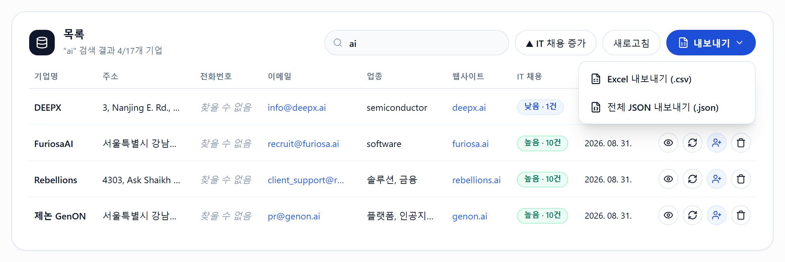

검색창은 기업명, 이메일, 업종, 웹사이트, 주소로 즉시 필터링합니다. **내보내기**는
**현재 보이는 행만** Excel(.csv, 한글이 깨지지 않도록 BOM 포함) 또는 전체 JSON으로
저장합니다 — 기업 하나만 받고 싶다면 이름으로 검색한 뒤 내보내면 됩니다.

### 10. 두 가지 언어

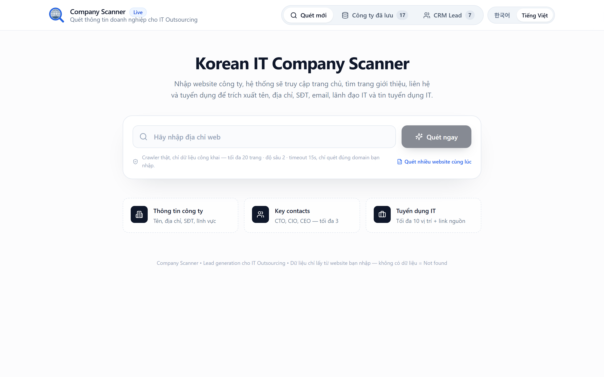

같은 화면의 베트남어 버전입니다. 언어 전환은 즉시 적용되고 보고 있던 결과는 그대로
유지되며, 선택은 다음 방문에도 기억됩니다.

### 11. 명확한 오류 메시지

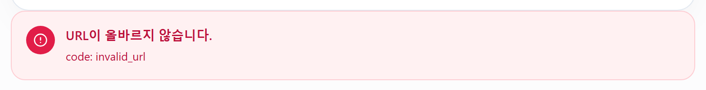

접속 불가, 시간 초과, 차단, 잘못된 URL — 상황마다 별도 메시지와 오류 코드를
보여줍니다. `localhost`나 사설 IP 같은 내부 주소는 처음부터 차단하여 앱이 내부망
스캔에 악용되지 않도록 합니다.

### 12. CRM 리드 — 한국 시장용 영업 파이프라인

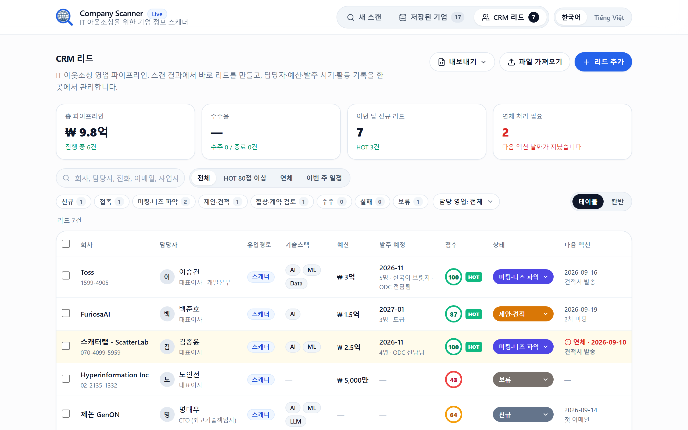

`/crm` 페이지는 스캔 이후 리드가 이어지는 곳입니다. 스캔 결과의 **CRM 리드로 추가**
(또는 저장된 기업 페이지의 **리드** 버튼)를 누르면 기업명, 최상위 담당자, 직급,
전화, 이메일, 채용 공고에서 뽑은 기술스택, IT 채용 신호가 채워진 리드가 바로
만들어집니다 — 다시 입력할 필요가 없습니다. KPI 네 칸: 총 파이프라인(₩ 억), 수주율,
이번 달 신규 리드, 연체 리드 수. HOT 80점 이상 / 연체 / 이번 주 일정 빠른 필터,
상태·담당 영업 필터, 전체 항목 검색을 지원합니다.

파이프라인은 한국 B2B 영업 주기를 따릅니다: 신규 → 접촉 → 미팅·니즈 파악 →
제안·견적 → 협상·계약 검토 → 수주 / 실패 / 보류. **실패**로 바꿀 때는 사유(가격,
일정, 경쟁사, 내부 개발, 예산 취소, 언어·소통 우려)를 반드시 선택해 나중에 어디서
졌는지 알 수 있게 합니다.

### 13. 한국 특화 항목과 근거 있는 점수

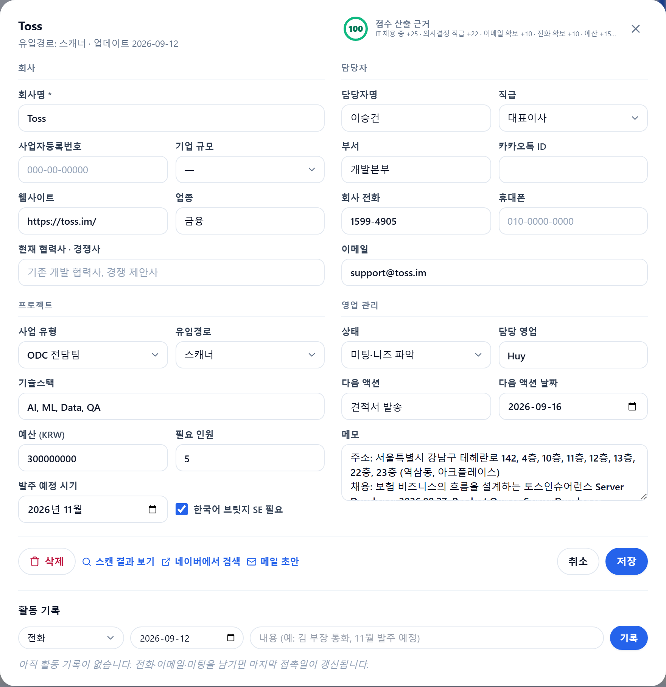

기본 정보 외에 사업자등록번호, 직급(사원 → 대표이사, CTO/CIO), 부서, 휴대폰 +
카카오톡 ID, 기업 규모(대기업/중견/중소/스타트업/공공), 사업 유형(파견/도급/SI/SM/ODC),
`1억 5000만`처럼 입력 가능한 KRW 예산, **필요 인원**, **발주 예정 시기**(연말 예산
확정, 상·하반기 발주), **한국어 브릿지 SE 필요 여부**, 현재 협력사·경쟁사, 담당 영업,
다음 액션과 날짜가 있습니다. 리드 점수 0–100은 명확한 규칙(IT 채용, 의사결정 직급,
이메일/전화/카카오톡 확보, 예산, 유입경로, 발주 임박, 팀 단위 수요)으로 계산하고
**산출 근거**를 바로 보여줍니다 — 무작위 숫자가 없습니다. 아래 **활동 기록**(전화,
이메일, 카카오톡, 미팅, 제안서/견적서 발송)에 한 줄 남기면 마지막 접촉일이 자동
갱신됩니다.

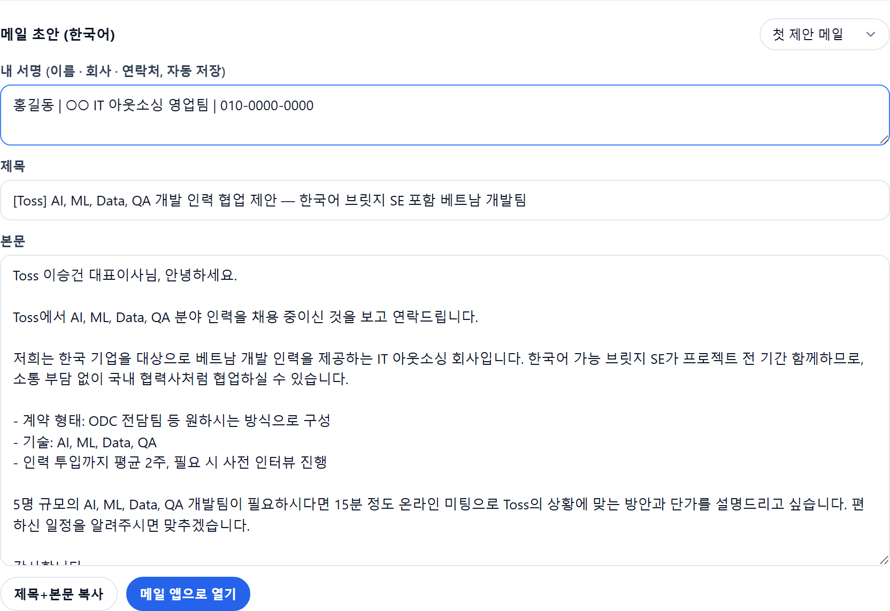

**메일 초안** 버튼은 리드 데이터로 한국어 메일을 바로 작성합니다. 3가지 템플릿(첫
제안 / 미팅 후 팔로업 / 견적서 발송)에 회사명, `담당자 직급님`, 기술스택, 필요 인원,
사업 유형, 발주 예정 월, 내 서명(브라우저에 저장)이 자동으로 들어갑니다. 복사하거나
수신자가 채워진 상태로 메일 앱에서 바로 열 수 있습니다. 내보내기 메뉴의 **캘린더
.ics**를 Google/Naver 캘린더나 Outlook에 넣으면 앱을 열지 않아도 "다음 액션" 알림을
받습니다.

### 14. 드래그 앤 드롭 칸반

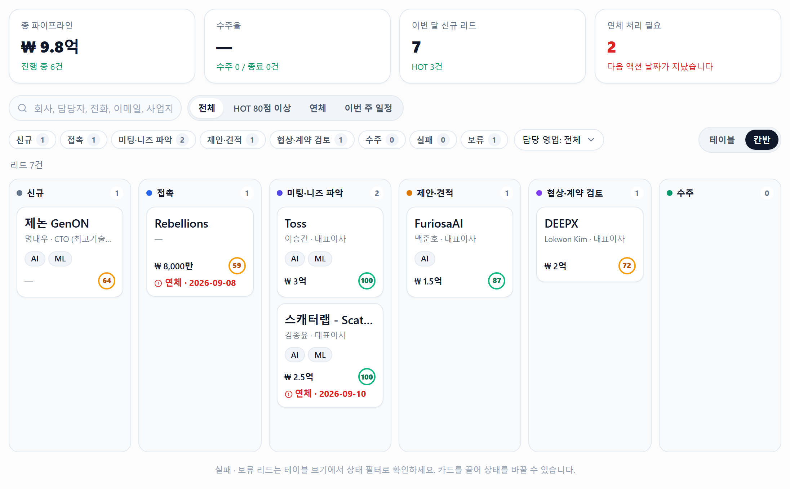

같은 데이터를 상태별 열로 봅니다. 카드를 다른 열로 끌면 상태가 바뀌고 즉시
저장되며, 연체 카드는 빨간 표시가 붙습니다. 테이블에서는 여러 리드를 선택해 상태를
일괄 변경하거나 삭제할 수 있습니다.

### 15. 한국어 Excel 가져오기, Excel / JSON 내보내기

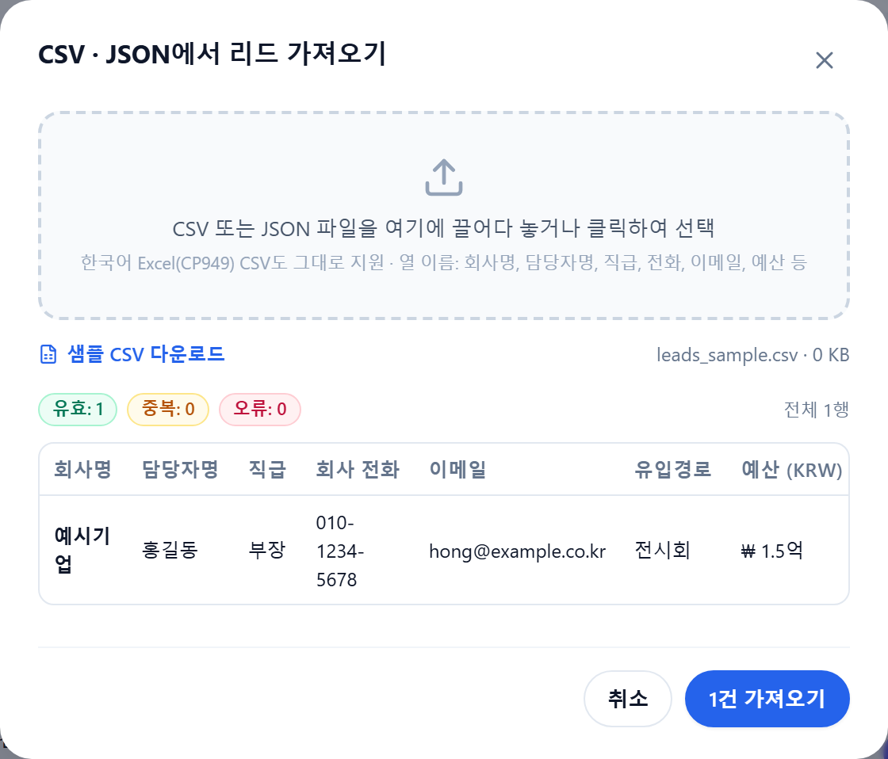

CSV/JSON을 끌어다 놓으면 한국어 Excel이 기본으로 저장하는 **CP949** CSV도 깨지지
않고 읽고, 한국어/베트남어/영어 열 이름(회사명, 담당자명, 직급, 휴대폰, 예산,
발주예정…)을 인식하며, 직급 / 유입경로 / 상태를 표준 코드로 변환합니다. 저장 전에
유효 / 중복(이메일 또는 회사+담당자 기준) / 오류 건수를 **미리보기**로 확인하고,
샘플 CSV도 내려받을 수 있습니다. 현재 보이는 리드를 CSV(BOM 포함, Excel에서 바로
열림) 또는 JSON으로 내보냅니다.

## 언어

기본 언어는 **한국어**입니다. 헤더 오른쪽 버튼으로 한국어 ↔ Tiếng Việt를 즉시 전환할
수 있고, 선택한 언어는 브라우저에 저장되어 다음 방문에도 유지됩니다. 화면 문구는
모두 `frontend/i18n.js`의 사전에서 가져옵니다.

번역 누락 검사:

```bash
python backend/check_i18n.py
```

두 사전의 키가 일치하는지, 코드가 사용하는 키가 사전에 있는지, HTML/JS에 번역을
거치지 않은 문자열이 남아 있는지 확인합니다.

## 실행 방법

`run.bat`을 더블클릭하세요(Windows). Linux/macOS는 `./run.sh`.

실행기는 Python 확인 → 필요한 패키지 자동 설치 → 비어 있는 포트 선택(8000, 사용 중이면
8001, 8002…) → 브라우저 자동 실행 순서로 진행합니다. 창에 주소가 출력됩니다.

```
App dang chay tai:  http://127.0.0.1:8000
```

브라우저가 자동으로 열리지 않으면 그 주소를 직접 입력하세요.
검은 창에서 Ctrl+C를 누르면 앱이 종료됩니다.

특정 포트를 지정하려면:

```bash
python start.py 8080
```

### 앱이 열리지 않을 때

`run.bat` 창은 오류가 나도 닫히지 않습니다. 창의 `[LOI]` 줄을 확인하세요.

| 증상 | 해결 |
|---|---|
| `[LOI] Khong tim thay Python` | Python 3.10 이상 설치, 설치 시 "Add python.exe to PATH" 체크 |
| 패키지 설치 단계에서 멈춤 | 직접 실행: `python -m pip install -r backend/requirements.txt` |
| 포트가 사용 중이라 8001로 넘어감 | 정상입니다 — 창에 출력된 주소를 사용하세요 |
| `localhost:8000`이 빈 화면 / 연결 안 됨 | 앱이 실행 중이 아니거나 이전 python 프로세스가 포트를 잡고 있음. 이전 창을 모두 닫고 `run.bat` 재실행 |
| Windows 방화벽 경고 | 허용을 선택하세요 — 앱은 127.0.0.1에서만 동작합니다 |

남아 있는 프로세스 정리(PowerShell):

```bash
Get-CimInstance Win32_Process -Filter "Name='python.exe'" | Where-Object { $_.CommandLine -match 'uvicorn|start.py' } | ForEach-Object { Stop-Process -Id $_.ProcessId -Force }
```

Playwright는 선택 사항이며 JavaScript로 렌더링되는 사이트에만 사용됩니다. 활성화하려면:

```bash
python -m playwright install chromium
```

설치하지 않아도 동작합니다 — 이 경우 정적 HTML만 읽고 렌더링 단계를 건너뜁니다.

## 명령줄에서 스캔

```bash
python backend/scan_cli.py https://www.hyperinfo.co.kr
```

API가 반환하는 것과 동일한 JSON을 출력하며, 크롤링 진행 상황은 stderr로 표시됩니다.

### 정기 재스캔 / 일괄 스캔 (명령줄)

```bash
python backend/rescan_cli.py                 # 저장된 기업 전체 재스캔
python backend/rescan_cli.py --days 7        # 7일 이상 스캔하지 않은 기업만
python backend/rescan_cli.py --urls list.txt # 파일의 URL을 한 줄씩 스캔 + 저장 — 2b의 명령줄 버전
```

사이트 사이에 2초 쉬며 순차로 스캔해 데이터베이스에 바로 저장하고, 이전 스캔 대비
▲/▼ 표를 출력한 뒤 IT 채용이 늘어난 기업만 따로 정리합니다. Windows에서 매주 자동
실행하려면 작업 스케줄러 → 기본 작업 만들기 → 매주 → 동작 "프로그램 시작", 프로그램
`python`, 인수 `backend\rescan_cli.py`, 시작 위치는 프로젝트 폴더로 지정합니다.
월요일 아침 "저장된 기업"에서 **▲ IT 채용 증가**를 누르면 누가 채용을 늘렸는지 바로
보입니다.

## 테스트

```bash
python backend/test_scanner.py
```

네트워크 없이 실행되는 오프라인 테스트입니다. 한국어 인코딩, 도메인 격리, SSRF 차단,
주요 담당자 / IT 채용 공고 필터링, 데이터가 없는 경우를 검사합니다.

## 구조

```
backend/app/security.py    URL 검사, localhost / 사설 IP / 메타데이터 IP 차단
backend/app/crawler.py     실제 크롤링: fetch, 인코딩, 도메인 격리, Playwright
backend/app/extractor.py   기업 / 주요 담당자 / IT 채용 정보 추출
backend/app/storage.py     SQLite: 저장 / 목록 / 다시 열기 / 삭제, 스캔 이력(scan_history)
backend/app/crm.py         CRM: 리드, 점수 계산, CSV/JSON(CP949) 가져오기, 활동 기록
backend/app/main.py        FastAPI: /api/scan, /api/scan/stream (SSE), /api/companies, /api/leads, 3개 페이지
start.py                   실행기: 환경 확인, 포트 선택, 브라우저 열기
backend/scan_cli.py        터미널에서 스캔
backend/rescan_cli.py      정기 재스캔 / URL 파일 일괄 스캔, 이력 기록
backend/test_scanner.py    오프라인 테스트
backend/check_i18n.py      번역 검사
backend/take_screenshots.py README용 실제 화면 캡처 (Playwright)
frontend/index.html        "새 스캔" 페이지 (프로토타입 레이아웃 유지)
frontend/saved.html        "저장된 기업" 페이지
frontend/crm.html          "CRM 리드" 페이지
frontend/i18n.js           한국어/베트남어 사전, 언어 전환
frontend/app.js            세 페이지 공용: API 호출, 결과 렌더링, 내보내기, 목록
frontend/crm.js            CRM 페이지: KPI, 테이블, 칸반, 리드 폼, 파일 가져오기/내보내기
frontend/tailwind.css      프로토타입에서 그대로 가져온 컴파일 CSS
frontend/app.css           프로토타입에 없던 클래스 보완 (IT 채용 색상, 오류, 언어 버튼, CRM 전체)
```

`Company-Scanner-Prototype-Ui (1).html`은 UI 참고용으로 남겨둔 파일이며 앱은 사용하지 않습니다.

## 세 개의 페이지

헤더 오른쪽에 세 페이지 이동 버튼이 항상 표시됩니다.

| 페이지 | URL | 내용 |
|---|---|---|
| 새 스캔 | `/` | URL 입력, 스캔, 결과 확인, 데이터베이스 저장 |
| 저장된 기업 | `/saved` | 데이터베이스에 저장된 전체 기업 목록 |
| CRM 리드 | `/crm` | 영업 파이프라인: 리드, 점수, 활동, 가져오기/내보내기 |

"저장된 기업" 버튼의 숫자는 현재 저장된 기업 수, "CRM 리드"의 숫자는 리드 수입니다.

## 데이터베이스 저장

스캔이 끝나면 **"데이터베이스에 저장"**("JSON 보기" 옆 버튼)을 누르세요.

`/saved` 페이지의 표:

| 열 | 내용 |
|---|---|
| 기업명 | `company.name` |
| 주소 | `company.address` |
| 전화번호 | `company.phone` |
| 이메일 | `company.email`, 클릭하면 메일 작성 |
| 업종 | `company.industry` |
| 웹사이트 | 도메인, 클릭하면 새 탭에서 열림 |
| IT 채용 | 신호 등급과 건수, 예: `높음 · 8건` |
| 업데이트 | 마지막 스캔/저장 날짜 |

검색창은 기업명, 이메일, 업종, 웹사이트, 주소로 필터링합니다. 각 행에는 **보기**
(`/?company=<id>`로 이동 — 다시 스캔하지 않고 주요 담당자·채용 공고·출처 링크를 포함한
전체 결과를 표시)와 **삭제**(확인 후 실행) 버튼이 있습니다.

데이터베이스는 SQLite이며 기본 경로는 `data/companies.db`입니다. 환경 변수
`SCANNER_DB`로 위치를 바꿀 수 있습니다. 도메인을 키로 사용하므로 같은 웹사이트를 다시
스캔하면 중복 행이 생기지 않고 기존 행이 **갱신**됩니다.

데이터베이스를 완전히 지우려면 앱을 종료한 뒤 `data/` 폴더를 삭제하세요.

## 파일 내보내기

**내보내기** 버튼은 `/saved` 페이지에 있으며 **현재 화면에 보이는 행만** 내보냅니다.
검색 중이라면 검색 결과만 나가므로, 특정 기업 하나만 받고 싶다면 검색창에 그 기업명을
입력한 뒤 내보내면 됩니다. 파일 이름에도 검색어가 붙습니다.

| 형식 | 내용 |
|---|---|
| Excel (.csv) | 기업당 한 행: 기업명, 주소, 전화번호, 이메일, 업종, 웹사이트, IT 채용, IT 포지션 수, 주요 담당자 수, 업데이트 날짜. Excel에서 한글이 깨지지 않도록 BOM 포함 |
| 전체 JSON (.json) | 기업별 스캔 결과 전체: 주요 담당자, 채용 공고, 출처 URL |

## API

`POST /api/scan` — 본문 `{"url": "..."}` → 결과 JSON.

`GET /api/scan/stream?url=...` — Server-Sent Events로 크롤러의 실제 진행 상황을 전송
(`homepage` → `company` → `contact` → `management` → `recruitment` → `extract` → `done`)하고
마지막에 `result` 또는 `scan_error` 이벤트로 끝납니다. 프런트엔드가 이 엔드포인트를
사용하므로 진행 표시는 가짜 타이머가 아니라 크롤러의 실제 상태입니다.

결과 형식:

```json
{
  "company":        { "name": "", "address": "", "phone": "", "email": "", "industry": "", "website": "" },
  "company_sources":{ "name": "", "address": "", "phone": "", "email": "", "industry": "" },
  "key_contacts":   [ { "name": "", "position": "", "source_url": "" } ],
  "it_recruitment": [ { "title": "", "position": "", "location": "", "employment_type": "",
                        "deadline": "", "description": "", "source_url": "" } ],
  "sales_signal":   { "it_hiring": "High | Medium | Low | None" },
  "sources":        [],
  "scanned_url":    "",
  "pages_crawled":  0
}
```

찾지 못한 항목은 `null`이며 화면에는 `찾을 수 없음`으로 표시됩니다.
`company_sources`는 각 항목의 근거가 된 URL입니다(출처 검증 요구사항).

`sales_signal.it_hiring` 값은 API·JSON에서 `High / Medium / Low / None`으로 유지되고,
화면과 CSV에서는 `높음 / 보통 / 낮음 / 없음`으로 표시됩니다.

데이터베이스 엔드포인트:

| Method | Endpoint | 기능 |
|---|---|---|
| POST | `/api/companies` | 스캔 결과 저장(본문 `{"result": {...}}`), 도메인 기준 upsert |
| GET | `/api/companies` | 요약 목록, 최근 갱신 순 |
| GET | `/api/companies?full=1` | 위와 동일 + 전체 스캔 결과(JSON 내보내기용) |
| GET | `/api/companies/{id}` | 요약 + 저장된 전체 스캔 결과 + 스캔 `history` |
| DELETE | `/api/companies/{id}` | 기업 한 건 삭제 |

CRM:

| Method | Endpoint | 역할 |
|---|---|---|
| GET | `/api/leads` | 전체 리드, 최근 업데이트 순 (`overdue` 포함) |
| POST | `/api/leads` | 리드 생성 (body `{"lead": {...}}`), 서버가 정규화·점수 계산 |
| GET | `/api/leads/{id}` | 리드 + `score_breakdown` + `activities` |
| PUT | `/api/leads/{id}` | 부분 수정 (바뀐 항목만 전송), 점수 재계산 |
| DELETE | `/api/leads/{id}` | 리드 삭제 (활동 기록도 함께 삭제) |
| POST | `/api/leads/delete` | 일괄 삭제: body `{"ids": [...]}` |
| POST | `/api/leads/from-company/{company_id}` | 스캔한 기업에서 리드 생성; 이미 있으면 기존 리드 반환 |
| POST | `/api/leads/import` | Body `{"filename", "content_base64", "commit"}`; `commit=false`는 미리보기만 |
| GET | `/api/leads/sample.csv` | 가져오기가 인식하는 열로 된 샘플 CSV |
| GET | `/api/leads/calendar.ics` | iCalendar: "다음 액션 날짜"가 있는 진행 중 리드마다 종일 일정 하나 |
| POST | `/api/leads/{id}/activities` | 활동 기록 `{"activity": {"type", "at", "note"}}`, 마지막 접촉일 갱신 |
| DELETE | `/api/activities/{id}` | 활동 한 건 삭제 |

## 크롤링 제한

| | |
|---|---|
| MAX_PAGES | 20 |
| MAX_DEPTH | 2 |
| TIMEOUT | 요청당 15초 |

입력한 URL의 도메인(및 그 하위 도메인)만 크롤링합니다. 다른 도메인 링크는 블로그나
외부 채용 포털이라도 모두 제외합니다. 페이지의 링크 외에 `sitemap.xml`도 읽어 메뉴에
없는 채용 페이지를 찾습니다.

**푸터를 먼저 읽습니다.** 한국 웹사이트는 상호 / 대표이사 / 주소 / 전화 / 이메일 /
사업자등록번호를 대부분 푸터에 두고 모든 페이지에 반복합니다. 앱은 전체 본문보다 먼저
푸터 영역(`<footer>`, `<address>`, class/id에 "footer"가 포함된 요소, 그리고 페이지
하단부)을 읽습니다. 더 정확하고(지사 주소나 보도자료 속 협력사 전화번호를 피함) 더
빠릅니다. 홈페이지 푸터에 주소 + 전화 + 이메일이 모두 있으면 연락처·소개 페이지의
우선순위를 낮추고, 남은 페이지 예산을 자주 누락되는 경영진·채용 쪽에 씁니다.

**홈페이지에 정보를 두지 않는 사이트**를 위해 크롤러는 네 가지를 추가로 합니다.

1. **페이지 예산을 끝까지 사용** — 우선순위 페이지를 다 돌고도 예산이 남으면 같은
   도메인의 다른 페이지를 얕은 순서로 더 읽습니다(뉴스·블로그·갤러리는 제외).
2. **내용 기반 재분류** — `모집분야`, `입사지원`, `지원자격` 등이 있으면 링크에 키워드가
   없어도 채용 페이지로 봅니다. IT 채용 공고는 채용 페이지에서만 읽으므로 이 단계가
   결과를 좌우합니다.
3. **최종 URL과 내용 기준 중복 제거** — 존재하지 않는 URL을 홈으로 리다이렉트하는
   사이트가 많고, 한국 CMS는 같은 페이지를 여러 파라미터로 제공합니다. 제거하지 않으면
   20페이지 예산이 사본으로 다 소진됩니다.
4. **`<frame>` / `<iframe>` 읽기** — 예전 방식 사이트는 홈페이지를 비워 두고 내용과
   메뉴를 프레임 안에 넣습니다. 프레임을 열지 않으면 첫 페이지에서 크롤링이 멈춥니다.

## 추출 규칙

**기업 정보** — 이름은 여러 신호(JSON-LD, `og:site_name`, `상호/회사명` 라벨,
copyright 줄, `<title>`)를 점수화해 공식 출처와 도메인 일치를 우선합니다. 주소는 본사를
우선하고 같은 줄에 붙은 Tel/Fax는 잘라냅니다. 전화번호는 라벨이 붙은 유선번호를
우선하고 팩스는 제외합니다. 국제 표기(`+82-2-...`)는 국내 표기(`02-...`)로 정규화합니다.

**이메일** — `mailto:` 링크와 라벨이 붙은 항목을 우선하며, **회사 도메인 또는 무료
메일함에 속한 주소만** 인정합니다. 기업 웹사이트의 보도자료에는 다른 도메인의 기자
이메일이 함께 실리는 경우가 많아 그대로 가져오면 틀립니다. **Cloudflare Email
Protection**(`data-cfemail` / `/cdn-cgi/l/email-protection#...`)도 복호화합니다. 한국
사이트 상당수가 Cloudflare를 쓰며, 이메일은 방문자에게 공개되지만 HTML에는 암호화된
문자열로 들어 있습니다.

이메일을 **이미지로** 올린 사이트(예: hyperinfo.co.kr의 `email-about.png`)는
`찾을 수 없음`을 반환합니다. 추출할 글자가 없고 앱은 OCR을 하지 않습니다.

**주요 담당자** — 최대 3명, 우선순위는 CTO → CIO → IT 책임자 → 개발 책임자 →
개발본부장 → 개발팀장 → IT Director → CEO/대표이사. CFO/CMO/인사/영업/마케팅은 같은
사람이 CEO이거나 IT를 겸하지 않는 한 제외합니다. 잘못된 데이터를 막기 위해 이름은 한국
성으로 시작해야 하고 일반 명사가 아니어야 하며, `대표`처럼 모호한 직함은 짧은 한 줄
안에 있을 때만 인정합니다. 그렇지 않으면 보도자료에 실린 협력사 대표 이름이 잘못
들어갑니다. `박 한`처럼 성과 이름을 띄어 쓴 표기도 인식하고, `공지사항` 같은 4음절
명사는 복성이 아니면 이름으로 보지 않습니다.

**IT 채용** — 최대 10건, IT/소프트웨어 직무만 가져옵니다. 제목에 IT 키워드가 있는
것만으로는 부족하고 채용을 알리는 표현(모집/채용/공고/개발자/engineer…)이 있거나 해당
블록에 고용 형태·마감일이 있어야 합니다. 내비게이션 메뉴와 제품 링크는 제외합니다.

**IT 채용 신호**: 5건 이상 → High, 2–4건 → Medium, 1건 → Low, 0건 → None.

AI를 사용하지 않고 웹사이트 밖의 지식도 쓰지 않습니다. 모든 값은 해당 도메인에서
크롤링한 HTML에서만 추출합니다.

## 보안

`http://`와 `https://`만 허용합니다. localhost, 127.0.0.1, 0.0.0.0, 169.254.169.254,
사설 IP 대역, `file://`, 비정상 포트를 차단합니다. 리다이렉트는 매 단계 다시 검사하므로
우회해서 내부망을 가리킬 수 없습니다.

앱은 공개 데이터만 읽으며 기본적으로 `robots.txt`를 존중합니다. 사내 환경에서 끄려면
환경 변수 `RESPECT_ROBOTS=0`을 설정하세요. Playwright를 끄려면 `ALLOW_PLAYWRIGHT=0`.

## 오류 메시지

| 상황 | 메시지 |
|---|---|
| 접속 불가 / 도메인 미해석 | `웹사이트에 접속할 수 없습니다.` |
| 시간 초과 | `웹사이트 응답 시간이 초과되었습니다.` |
| 사이트가 차단 (401/403/429/451, robots) | `웹사이트가 요청을 차단했습니다.` |
| 잘못되거나 차단된 URL | `URL이 올바르지 않습니다.` + 사유 |
| 담당자 없음 | `주요 담당자를 찾을 수 없습니다.` |
| IT 채용 정보 없음 | `IT 채용 정보를 찾을 수 없습니다.` |

한 페이지가 실패해도 전체 스캔은 중단되지 않습니다. 크롤러는 해당 페이지를 건너뛰고
계속 진행합니다.
