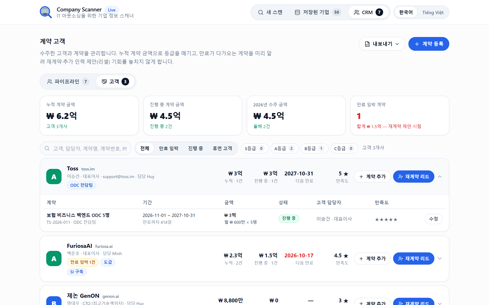
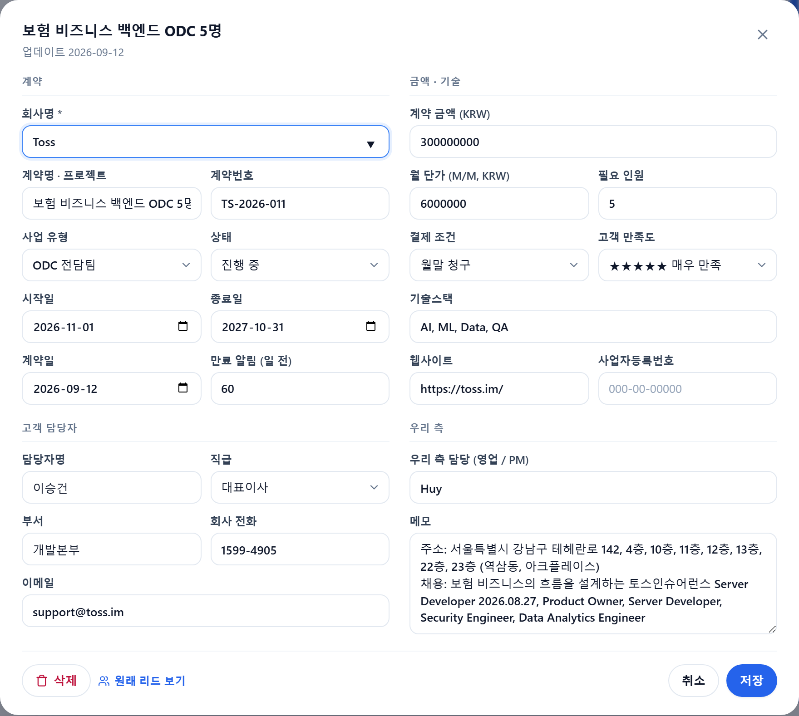

> [🇰🇷 한국어](README.ko.md) | 🇻🇳 Tiếng Việt

# Company Scanner

Quét thông tin doanh nghiệp từ website thật, phục vụ sales IT Outsourcing.

Nhập URL → app truy cập website thật, crawl các trang liên quan (giới thiệu, liên hệ,
ban lãnh đạo, tuyển dụng) và trích xuất thông tin có ích cho sales. Không có mock data:
mỗi URL là một lần scan độc lập, không tìm thấy thì trả `Not found`.

## Tính năng

Ảnh dưới đây là ảnh chụp thật của app, dữ liệu là kết quả quét thật từ website
`scatterlab.co.kr`. Ảnh CRM (12–16) dùng lead tạo từ các công ty đã quét thật; phần
ngân sách, trạng thái, lịch hẹn và các hợp đồng/số tiền ở ảnh 18–19 là dữ liệu nhập tay để
minh hoạ, không phải hợp đồng thật.
Chụp lại bằng `python backend/take_screenshots.py`.

### 1. Nhập URL, quét website thật


Dán địa chỉ website công ty Hàn Quốc rồi bấm **스캔 시작**. App truy cập website thật,
không dùng dữ liệu mẫu hay dữ liệu dự phòng — mỗi URL là một lần quét độc lập. Giao
diện mặc định tiếng Hàn, chuyển sang tiếng Việt bằng nút ở góc phải.

### 2. Tiến trình phản ánh đúng việc crawler đang làm


Bảy bước: truy cập trang chủ → tìm trang giới thiệu → liên hệ → ban lãnh đạo →
tuyển dụng → trích xuất → hoàn thành. Trạng thái được đẩy từ server qua Server-Sent
Events ngay khi crawler chuyển bước, nên đây là tiến trình thật chứ không phải hiệu
ứng chạy theo đồng hồ.

### 2b. Quét nhiều website cùng lúc


Bấm **여러 사이트 한꺼번에 스캔** dưới ô nhập: dán danh sách địa chỉ (mỗi dòng một
địa chỉ — dán từ Excel, Notepad hay KakaoTalk đều được, dấu phẩy/khoảng trắng cũng
tách được), hoặc nạp file `.txt`/`.csv` (app tự nhặt mọi thứ trông như website, cột nào
cũng được; có **file mẫu** để tải). Tối đa 50, tự bỏ trùng. App quét **tuần tự** bằng đúng
crawler của quét đơn, mỗi kết quả **tự lưu vào database** (ghi lịch sử ▲/▼), bảng bên
dưới cập nhật từng dòng: trạng thái, tên công ty, người liên hệ, IT Hiring, nút **보기**
mở chi tiết và **리드** đưa thẳng sang CRM. Site lỗi hiện lý do, không chặn các site còn
lại; có nút **중지** để dừng giữa chừng.

### 3. Thông tin công ty và key contacts, mỗi trường kèm nguồn


Tên, địa chỉ trụ sở, điện thoại, email, lĩnh vực, **사업자등록번호** và **대표자** — mỗi ô
có link **출처** trỏ về đúng trang chứa thông tin đó, để sales kiểm chứng trước khi liên
hệ. Hai trường cuối lấy từ footer: luật 전자상거래법 buộc website Hàn ghi mã số doanh
nghiệp và người đại diện ở đó, nên gần như site nào cũng có. 대표자 tìm được sẽ tự
bổ sung vào key contacts nếu còn chỗ. Bên phải là tối đa 3
người phụ trách quyết định IT, ưu tiên CTO → CIO → phụ trách IT/phát triển → CEO.
Thiếu dữ liệu thì hiển thị `찾을 수 없음`, không đoán, không lấp bằng công ty khác.

### 4. Tin tuyển dụng IT và tín hiệu IT Hiring


Chỉ lấy vị trí IT/phần mềm (tối đa 10), bỏ qua kinh doanh, kế toán, nhân sự. Mỗi tin
có vị trí, loại hình, hạn nộp và link đến đúng trang tuyển dụng. Góc phải là tín hiệu
**IT 채용**: 5+ tin → 높음, 2–4 → 보통, 1 → 낮음, 0 → 없음 — công ty đang tuyển nhiều
IT là công ty đang cần nguồn lực.

### 5. Nguồn dữ liệu — mọi thứ đều có bằng chứng


Danh sách toàn bộ trang đã crawl, tất cả đều thuộc domain đã nhập. Link sang domain
khác — blog, portal tuyển dụng ngoài — đều bị loại để không lẫn dữ liệu của công ty khác.

### 6. JSON có cấu trúc


Bấm **JSON 보기** để xem đúng cấu trúc mà API trả về, có nút copy — dùng khi cần đưa
kết quả vào hệ thống khác.

### 7. Lưu vào database


Một nút **데이터베이스에 저장**. Khoá theo domain: quét lại cùng website sẽ cập nhật
dòng cũ chứ không tạo bản trùng.

### 8. Danh sách công ty đã lưu


Trang riêng `/saved` liệt kê mọi công ty đã lưu với tên, địa chỉ, điện thoại, email,
lĩnh vực, website, IT Hiring kèm số lượng, ngày cập nhật. Bấm vào dòng (hoặc nút mắt)
mở lại toàn bộ kết quả mà không phải quét lại; nút ↻ **quét lại** ngay công ty đó; nút
thùng rác xoá sau khi xác nhận.

Mỗi lần lưu ghi thêm một dòng lịch sử. Quét lại mà số tin tuyển IT tăng thì cột IT
Hiring hiện **▲ +N** (giảm thì ▼); nút **▲ IT 채용 증가** lọc riêng các công ty đang
tăng — công ty vừa tăng từ 2 lên 8 tin tuyển IT là công ty sắp cần người, đây là tín
hiệu mua rõ nhất mà scanner có thể cho. Quét lại toàn bộ theo lịch bằng
`backend/rescan_cli.py` (xem mục "Quét từ command line").

### 9. Tìm kiếm và xuất Excel / JSON


Ô tìm kiếm lọc tại chỗ theo tên, email, lĩnh vực, website, địa chỉ. Nút **내보내기**
xuất **đúng những dòng đang hiển thị** ra Excel (.csv, có BOM để mở đúng tiếng Hàn)
hoặc JSON đầy đủ — muốn lấy riêng một công ty thì lọc tên rồi xuất.

### 10. Hai ngôn ngữ


Cùng một giao diện bằng tiếng Việt. Đổi ngôn ngữ áp dụng ngay, kết quả đang xem vẫn
giữ nguyên, lựa chọn được nhớ cho lần sau.

### 11. Thông báo lỗi rõ ràng


Website không truy cập được, timeout, bị chặn, URL không hợp lệ — mỗi trường hợp một
thông báo riêng kèm mã lỗi. Địa chỉ nội bộ như `localhost` hay IP private bị chặn ngay
từ đầu để app không thể bị lợi dụng quét mạng nội bộ.

### 12. CRM lead — pipeline bán hàng cho thị trường Hàn


Trang `/crm` là nơi lead đi tiếp sau khi quét. Bấm **CRM 리드로 추가** trên kết quả quét
(hoặc nút **리드** ở trang công ty đã lưu) là có ngay một lead điền sẵn tên công ty,
người liên hệ cao nhất, chức danh, điện thoại, email, tech stack lấy từ tin tuyển
dụng và tín hiệu IT Hiring — không nhập lại tay. Bốn ô KPI: tổng pipeline (₩ 억),
tỉ lệ thắng, lead mới tháng này, số lead quá hạn. Lọc nhanh HOT ≥ 80 điểm / quá hạn /
lịch tuần này, lọc theo trạng thái và sales phụ trách, tìm theo mọi trường.

Pipeline theo chu kỳ B2B Hàn Quốc: 신규 → 접촉 → 미팅·니즈 파악 → 제안·견적 →
협상·계약 검토 → 수주 / 실패 / 보류. Chuyển sang **실패** bắt buộc chọn lý do
(giá, tiến độ, đối thủ, tự phát triển, huỷ ngân sách, lo ngại ngôn ngữ) để sau này
biết mình thua ở đâu.

### 13. Hồ sơ lead với các trường đặc thù Hàn Quốc + điểm có giải thích


Ngoài thông tin cơ bản, lead có 사업자등록번호, 직급 (사원 → 대표이사, CTO/CIO),
부서, 휴대폰 + 카카오톡 ID, quy mô (대기업/중견/중소/스타트업/공공), hình thức dự án
(파견/도급/SI/SM/ODC), ngân sách KRW nhập được `1억 5000만`, **số nhân sự cần**,
**thời điểm 발주 dự kiến** (Hàn chốt ngân sách cuối năm, phát 발주 theo 상반기/하반기),
**cần bridge SE tiếng Hàn** hay không, vendor hiện tại / đối thủ, sales phụ trách,
hành động tiếp + ngày. Điểm lead 0–100 tính theo quy tắc rõ ràng (IT Hiring, cấp ra
quyết định, có email/điện thoại/KakaoTalk, ngân sách, nguồn, 발주 sắp tới, nhu cầu cả
team) và hiện ngay **cách tính** — không có số ngẫu nhiên. Phía dưới là **nhật ký hoạt
động** (gọi, email, KakaoTalk, họp, gửi đề xuất/báo giá); ghi một dòng là ngày liên hệ
gần nhất tự cập nhật.


Nút **메일 초안** soạn sẵn email tiếng Hàn từ dữ liệu lead: 3 mẫu (đề xuất đầu tiên /
follow-up sau họp / gửi báo giá), tự điền công ty, `담당자 직급님`, tech stack, số nhân
sự, hình thức dự án, tháng 발주 và chữ ký của bạn (nhớ trong trình duyệt). Copy hoặc
mở thẳng trong ứng dụng mail với địa chỉ người nhận đã có. Menu Xuất có thêm
**lịch .ics** — nhập vào Google/Naver Calendar/Outlook để được nhắc "다음 액션" mà
không cần mở app.

### 14. Kanban kéo thả


Cùng dữ liệu ở dạng cột theo trạng thái. Kéo thẻ sang cột khác là đổi trạng thái và lưu
ngay; thẻ quá hạn có nhãn đỏ. Ở bảng có thể chọn nhiều lead để đổi trạng thái hoặc xoá
hàng loạt.

### 15. Nhập từ Excel Hàn, xuất Excel / JSON


Kéo thả CSV/JSON: app đọc được cả CSV **CP949** mà Excel tiếng Hàn lưu mặc định (không
vỡ chữ), nhận tên cột tiếng Hàn / Việt / Anh (회사명, 담당자명, 직급, 휴대폰, 예산,
발주예정…), quy đổi 직급 / 유입경로 / 상태 về mã chuẩn, và **xem trước** số dòng hợp lệ,
trùng (theo email hoặc công ty + người liên hệ), lỗi trước khi ghi. Có CSV mẫu để tải.
Xuất CSV (BOM, mở đúng trong Excel) hoặc JSON đúng những lead đang hiển thị.

### 16. Khách hàng đã ký hợp đồng — giá trị, thời hạn, xếp hạng, cơ hội tái ký



Màn hình **고객** (tab CRM → 파이프라인 | 고객, URL `/crm/customers`) là bước sau khi thắng deal.
Lead nào thuộc công ty đã ký hợp đồng được gắn nhãn **기존 고객 · hạng** ngay trong bảng
pipeline, và mở lead lên là thấy dải "khách cũ · hạng · tổng đã ký · hết hạn gần nhất →
계약 보기" — sales biết ngay mình đang nói chuyện với khách cũ. Ở CRM, đổi lead sang **수주** là app hỏi
ghi hợp đồng ngay — form mở với công ty, người liên hệ, ngân sách, số người, tháng bắt
đầu điền sẵn từ lead. Mỗi khách hàng gom mọi hợp đồng của cùng công ty và hiện: **tổng giá
trị đã ký** (LTV), giá trị đang thực hiện, ngày hết hạn gần nhất, mức hài lòng, số lần tái
ký. **Hạng S/A/B/C** tính theo quy tắc công khai (S: ≥ 5억 hoặc ≥ 2억 với ≥ 3 hợp đồng;
A: ≥ 2억 hoặc ≥ 5천만 với ≥ 2 hợp đồng; B: ≥ 5천만) — di chuột vào hạng là thấy lý do.

Để không bỏ lỡ resell: hợp đồng còn ≤ 60 ngày (tuỳ chỉnh từng hợp đồng) được gắn
**만료 임박**, KPI đầu trang gom tổng giá trị sắp hết hạn, lọc nhanh **만료 임박 / 휴면 고객**
(khách không còn hợp đồng đang chạy), và lịch `.ics` có sẵn sự kiện "계약 만료 60일 전 —
재계약 제안". Nút **재계약 리드** tạo ngay một lead ở CRM với nguồn *기존 고객* (điểm nguồn
cao nhất vì khách cũ chốt nhanh nhất), memo ghi sẵn lịch sử hợp đồng và hạng.



Hợp đồng có tên/số HĐ, hình thức (파견/도급/SI/SM/ODC), thời gian, **giá trị KRW** (nhập
được `2억 4000만`; bỏ trống thì tự tính = **đơn giá tháng M/M × người × số tháng** — cách
tính tiền của 파견/ODC), điều khoản thanh toán (월말 청구 / 선금·중도·잔금 / 분기 / 선불),
trạng thái (진행 중 / 완료 / 재계약됨 / 중도 해지 — 중도 해지 không tính vào hạng), liên hệ phía
khách, người phụ trách phía mình, tech stack, mức hài lòng ★1–5 và ghi chú. Xuất Excel
theo hợp đồng hoặc JSON theo khách hàng.

## Ngôn ngữ

Giao diện mặc định là **tiếng Hàn**. Nút ở góc phải header đổi qua lại 한국어 ↔ Tiếng Việt
ngay lập tức, và lựa chọn được lưu trong trình duyệt cho lần mở sau. Mọi chữ hiển thị
lấy từ từ điển trong `frontend/i18n.js`.

Kiểm tra bản dịch có thiếu chỗ nào không:

```bash
python backend/check_i18n.py
```

Script đối chiếu hai từ điển (ko/vi), kiểm tra mọi khoá code dùng đều tồn tại, và soát
xem HTML/JS còn chuỗi nào viết thẳng chưa qua i18n.

## Chạy app

Double-click `run.bat` (Windows) hoặc chạy `./run.sh` (Linux/macOS).

Launcher sẽ: kiểm tra Python → tự cài dependencies nếu thiếu → chọn port trống
(8000, bận thì 8001, 8002...) → tự mở trình duyệt. Cửa sổ in ra địa chỉ app, ví dụ:

```
App dang chay tai:  http://127.0.0.1:8000
```

Nếu trình duyệt không tự mở, copy đúng địa chỉ đó vào trình duyệt.
Nhấn Ctrl+C trong cửa sổ đen để dừng app.

Muốn ép một port cụ thể:

```bash
python start.py 8080
```

### Không mở được app?

Cửa sổ `run.bat` giữ nguyên khi có lỗi — đọc dòng `[LOI]` trong đó. Các trường hợp hay gặp:

| Hiện tượng | Cách xử lý |
|---|---|
| `[LOI] Khong tim thay Python` | Cài Python 3.10+, khi cài nhớ tick "Add python.exe to PATH" |
| Dừng ở bước cài dependencies | Chạy tay: `python -m pip install -r backend/requirements.txt` |
| Cửa sổ báo port bận rồi nhảy sang 8001 | Bình thường — dùng đúng địa chỉ mà cửa sổ in ra |
| Mở `localhost:8000` nhưng trắng trang / không kết nối | App chưa chạy, hoặc còn tiến trình python cũ giữ port. Đóng hết cửa sổ đen cũ rồi chạy lại `run.bat` |
| Windows hỏi Firewall | Chọn Allow — app chỉ chạy nội bộ trên 127.0.0.1 |

Dọn tiến trình cũ còn treo (PowerShell):

```bash
Get-CimInstance Win32_Process -Filter "Name='python.exe'" | Where-Object { $_.CommandLine -match 'uvicorn|start.py' } | ForEach-Object { Stop-Process -Id $_.ProcessId -Force }
```

Playwright là tuỳ chọn, chỉ dùng cho website render bằng JavaScript. Muốn bật:

```bash
python -m playwright install chromium
```

Không cài cũng chạy được — app sẽ đọc HTML tĩnh và bỏ qua bước render.

## Quét từ command line

```bash
python backend/scan_cli.py https://www.hyperinfo.co.kr
```

In ra đúng JSON mà API trả về; tiến trình crawl in ở stderr.

### Quét lại định kỳ / quét hàng loạt (dòng lệnh)

```bash
python backend/rescan_cli.py                 # quét lại mọi công ty đã lưu
python backend/rescan_cli.py --days 7        # chỉ công ty chưa quét trong 7 ngày
python backend/rescan_cli.py --urls list.txt # quét + lưu từng URL trong file (mỗi dòng một URL) — bản dòng lệnh của mục 2b
```

Quét tuần tự, nghỉ 2 giây giữa các site, lưu thẳng vào database và in bảng ▲/▼ so với
lần quét trước; cuối cùng liệt kê riêng các công ty tăng tin tuyển IT. Để chạy tự động
hàng tuần trên Windows: Task Scheduler → Create Basic Task → Weekly → Action
"Start a program", Program `python`, Arguments `backend\rescan_cli.py`, Start in
thư mục dự án. Sáng thứ Hai mở trang "Công ty đã lưu", bấm **▲ IT 채용 증가** là thấy
ai đang tuyển thêm.

## Chạy test

```bash
python backend/test_scanner.py
```

Test offline (không cần mạng): encoding tiếng Hàn, domain isolation, chặn SSRF,
lọc key contacts / tin tuyển dụng IT, và trường hợp không có dữ liệu.

## Cấu trúc

```
backend/app/security.py    Kiểm tra URL, chặn localhost / private IP / metadata IP
backend/app/crawler.py     Crawl thật: fetch, encoding, domain isolation, Playwright
backend/app/extractor.py   Trích xuất công ty / key contacts / tuyển dụng IT
backend/app/storage.py     SQLite: luu / liet ke / mo lai / xoa cong ty, lich su quet (scan_history)
backend/app/crm.py         CRM: lead, chấm điểm, nhập CSV/JSON (CP949), nhật ký hoạt động
backend/app/contracts.py   Khách hàng đã ký: hợp đồng, hạng S/A/B/C, sắp hết hạn, lead tái ký
backend/app/main.py        FastAPI: /api/scan, /api/scan/stream (SSE), /api/companies, /api/leads, /api/contracts, 4 trang
start.py                   Launcher: kiểm tra môi trường, chọn port, mở trình duyệt
backend/scan_cli.py        Quét từ terminal
backend/rescan_cli.py      Quét lại định kỳ / quét hàng loạt từ file URL, ghi lịch sử
backend/test_scanner.py    Test offline
backend/check_i18n.py      Kiểm tra bản dịch
backend/take_screenshots.py Chụp ảnh thật của app cho README (Playwright)
frontend/index.html        Trang "Quét mới" (giữ nguyên layout của prototype)
frontend/saved.html        Trang "Công ty đã lưu"
frontend/crm.html          Trang "CRM lead"
frontend/customers.html    Màn hình "고객" trong tab CRM (hợp đồng đã ký)
frontend/i18n.js           Từ điển tiếng Hàn/tiếng Việt, chuyển ngôn ngữ
frontend/app.js            Dùng chung 3 trang: gọi API, render kết quả, export, danh sách
frontend/crm.js            Trang CRM: KPI, bảng, Kanban, form lead, nhập/xuất file
frontend/customers.js      Trang khách hàng: thẻ khách, hợp đồng, form, xuất
frontend/tailwind.css      CSS compiled lấy nguyên từ prototype
frontend/app.css           Vài class bổ sung prototype chưa build (màu IT Hiring, lỗi, nút ngôn ngữ, toàn bộ CRM)
```

`Company-Scanner-Prototype-Ui (1).html` được giữ nguyên làm UI reference, app không dùng file này.

## Ba tab, bốn màn hình

Điều hướng nằm ở góc phải header. Hai tab đầu là *kết quả scanner*, tab CRM là *bán hàng*
và có thanh phụ **파이프라인 | 고객** ngay dưới tiêu đề:

| Tab | URL | Nội dung |
|---|---|---|
| Quét mới | `/` | Nhập URL, quét (đơn hoặc hàng loạt), xem kết quả, lưu vào database |
| Công ty đã lưu | `/saved` | Danh sách toàn bộ công ty trong database, xu hướng tuyển IT |
| CRM → 파이프라인 | `/crm` | Lead: điểm, trạng thái, hoạt động, mail nháp, nhập/xuất |
| CRM → 고객 | `/crm/customers` | Hợp đồng đã ký: giá trị, thời hạn, hạng, cơ hội tái ký |

Số trên tab "Công ty đã lưu" là số công ty; số trên tab "CRM" là số lead; thanh phụ hiện
cả số lead và số khách. Đường dẫn cũ `/customers` tự chuyển sang `/crm/customers`.

## Lưu vào database

Quét xong bấm **"Lưu vào database"** (nút cạnh "Xem JSON").

Trang `/saved` hiển thị bảng:

| Cột | Nội dung |
|---|---|
| Tên công ty | `company.name` |
| Địa chỉ | `company.address` |
| Số điện thoại | `company.phone` |
| Email | `company.email`, bấm để soạn thư |
| Lĩnh vực | `company.industry` |
| Website | Domain, bấm mở website trong tab mới |
| IT Hiring | Mức tín hiệu kèm số lượng, ví dụ `High · 8 vị trí` |
| Cập nhật | Ngày quét/lưu gần nhất |

Ô tìm kiếm lọc theo tên, email, lĩnh vực, website hoặc địa chỉ. Mỗi dòng có nút **Xem**
(mở `/?company=<id>` — trang quét hiển thị lại toàn bộ kết quả đã lưu, cả key contacts,
tin tuyển dụng và source link, không phải quét lại) và **Xoá** (có xác nhận trước).

Database là SQLite, mặc định ở `data/companies.db`. Đổi chỗ lưu bằng biến môi trường
`SCANNER_DB`. Khoá theo domain: quét lại cùng website sẽ **cập nhật** dòng cũ chứ không
tạo bản trùng, nên danh sách luôn là thông tin mới nhất của từng công ty.

Muốn xoá sạch database: đóng app rồi xoá thư mục `data/`.

## Xuất file

Nút **Xuất** nằm ở trang `/saved`, xuất **đúng những dòng đang hiển thị** — đang lọc thì
chỉ xuất phần khớp, nên muốn lấy riêng một công ty thì gõ tên công ty đó vào ô tìm kiếm
rồi xuất. Tên file kèm luôn từ khoá đang lọc.

| Định dạng | Nội dung |
|---|---|
| Excel (.csv) | Một dòng mỗi công ty: tên, địa chỉ, SĐT, email, lĩnh vực, website, IT Hiring, số vị trí IT, số key contacts, ngày cập nhật. Có BOM để Excel đọc đúng tiếng Hàn |
| JSON đầy đủ (.json) | Toàn bộ kết quả scan của từng công ty: key contacts, tin tuyển dụng, source URL |

## API

`POST /api/scan` với body `{"url": "..."}` → JSON kết quả.

`GET /api/scan/stream?url=...` → Server-Sent Events, phát tiến trình thật của crawler
(`homepage` → `company` → `contact` → `management` → `recruitment` → `extract` → `done`),
kết thúc bằng event `result` hoặc `scan_error`. Frontend dùng endpoint này nên thanh
tiến trình phản ánh đúng việc crawler đang làm, không phải timer giả.

Kết quả:

```json
{
  "company":        { "name": "", "address": "", "phone": "", "email": "", "industry": "", "website": "" },
  "company_sources":{ "name": "", "address": "", "phone": "", "email": "", "industry": "" },
  "key_contacts":   [ { "name": "", "position": "", "source_url": "" } ],
  "it_recruitment": [ { "title": "", "position": "", "location": "", "employment_type": "",
                        "deadline": "", "description": "", "source_url": "" } ],
  "sales_signal":   { "it_hiring": "High | Medium | Low | None" },
  "sources":        [],
  "scanned_url":    "",
  "pages_crawled":  0
}
```

Field nào không tìm được sẽ là `null`; UI hiển thị `찾을 수 없음` (tiếng Hàn) hoặc
`Not found` (tiếng Việt).
`company_sources` là URL bằng chứng cho từng field (yêu cầu source validation).

Giá trị `sales_signal.it_hiring` giữ nguyên `High / Medium / Low / None` trong API và
JSON; trên giao diện và trong CSV thì hiển thị theo ngôn ngữ (`높음 / 보통 / 낮음 / 없음`).

Các endpoint của database:

| Method | Endpoint | Việc |
|---|---|---|
| POST | `/api/companies` | Lưu kết quả scan (body `{"result": {...}}`), upsert theo domain |
| GET | `/api/companies` | Danh sách tóm tắt, mới cập nhật xếp trước |
| GET | `/api/companies?full=1` | Như trên, kèm toàn bộ kết quả scan (dùng khi xuất JSON) |
| GET | `/api/companies/{id}` | Tóm tắt + toàn bộ kết quả scan đã lưu + `history` các lần quét |
| DELETE | `/api/companies/{id}` | Xoá một công ty |

CRM:

| Method | Endpoint | Việc |
|---|---|---|
| GET | `/api/leads` | Toàn bộ lead, mới cập nhật xếp trước (kèm `overdue`) |
| POST | `/api/leads` | Tạo lead (body `{"lead": {...}}`), server chuẩn hoá và chấm điểm |
| GET | `/api/leads/{id}` | Lead + `score_breakdown` + `activities` |
| PUT | `/api/leads/{id}` | Sửa một phần (chỉ gửi trường thay đổi), điểm tính lại |
| DELETE | `/api/leads/{id}` | Xoá lead (xoá luôn nhật ký hoạt động) |
| POST | `/api/leads/delete` | Xoá nhiều: body `{"ids": [...]}` |
| POST | `/api/leads/from-company/{company_id}` | Tạo lead điền sẵn từ công ty đã quét; đã có thì trả lead cũ |
| POST | `/api/leads/import` | Body `{"filename", "content_base64", "commit"}`; `commit=false` chỉ xem trước |
| GET | `/api/leads/sample.csv` | CSV mẫu đúng cột import hiểu |
| GET | `/api/leads/calendar.ics` | Lịch iCalendar: một sự kiện cả ngày cho mỗi lead đang mở có "다음 액션 날짜" |
| POST | `/api/leads/{id}/activities` | Ghi hoạt động `{"activity": {"type", "at", "note"}}`, cập nhật liên hệ gần nhất |
| DELETE | `/api/activities/{id}` | Xoá một hoạt động |

Khách hàng / hợp đồng:

| Method | Endpoint | Việc |
|---|---|---|
| GET | `/api/customers` | Khách hàng gom theo công ty (hạng, tổng giá trị, sắp hết hạn, ngủ đông, danh sách hợp đồng) + `summary` KPI |
| POST | `/api/customers/{key}/lead` | Tạo lead tái ký ở CRM từ khách này (nguồn `customer`) |
| GET | `/api/contracts` | Mọi hợp đồng (kèm `days_left`, `expiring`) |
| POST | `/api/contracts` | Tạo hợp đồng `{"contract": {...}}`; thiếu `amount` thì tính từ `monthly_rate × team_size × tháng` |
| GET | `/api/contracts/from-lead/{lead_id}` | Hợp đồng điền sẵn từ lead (chưa ghi) |
| GET / PUT / DELETE | `/api/contracts/{id}` | Xem / sửa một phần / xoá |

## Giới hạn crawl

| | |
|---|---|
| MAX_PAGES | 20 |
| MAX_DEPTH | 2 |
| TIMEOUT | 15s / request |

Chỉ crawl domain của URL đã nhập (kể cả subdomain của chính domain đó). Link sang
domain khác — kể cả blog, portal tuyển dụng ngoài — đều bị loại. Ngoài link trên
trang, crawler còn đọc `sitemap.xml` để tìm trang tuyển dụng không có trong menu.

**Đọc footer trước.** Website Hàn gần như luôn đặt 상호 / 대표이사 / 주소 / 전화 /
이메일 / 사업자등록번호 ở footer, lặp trên mọi trang. App đọc vùng footer (thẻ
`<footer>`, `<address>`, class/id chứa "footer", cộng phần cuối trang) trước khi đọc
toàn bộ nội dung — vừa chính xác hơn (tránh địa chỉ chi nhánh hay số điện thoại của
đối tác trong bản tin), vừa nhanh hơn. Nếu footer trang chủ đã có đủ địa chỉ + điện
thoại + email thì crawler hạ ưu tiên các trang liên hệ/giới thiệu và dồn hạn mức trang
cho ban lãnh đạo và tuyển dụng — phần hay thiếu.

**Với site không đặt thông tin ở trang chủ**, crawler làm thêm 3 việc:

1. **Dùng hết hạn mức trang** — sau khi đi hết các trang ưu tiên, nếu còn hạn mức thì
   đọc tiếp các trang cùng domain (ưu tiên trang nông), bỏ qua trang tin/blog/thư viện ảnh.
2. **Phân loại lại theo nội dung** — trang có `모집분야`, `입사지원`, `지원자격`... được
   coi là trang tuyển dụng dù link không có từ khoá nào; tin IT chỉ được đọc từ trang
   tuyển dụng nên bước này quyết định tìm được hay không.
3. **Khử trùng lặp theo URL đích và theo nội dung** — nhiều site redirect URL không tồn
   tại về trang chủ; CMS Hàn còn phục vụ cùng một trang dưới nhiều tham số URL. Không
   khử thì cả hạn mức 20 trang bị đốt vào các bản sao.
4. **Đọc `<frame>` / `<iframe>`** — site kiểu cũ để trang chủ rỗng và nhét toàn bộ nội
   dung lẫn menu vào frame; không mở frame thì crawl dừng ngay ở trang đầu.

## Quy tắc trích xuất

**Company** — tên lấy từ nhiều tín hiệu (JSON-LD, `og:site_name`, nhãn `상호/회사명`,
dòng copyright, `<title>`) rồi chấm điểm, ưu tiên nguồn chính thức và tên khớp domain.
Địa chỉ ưu tiên trụ sở chính (`본사`) và cắt bỏ phần Tel/Fax dính chung dòng.
Điện thoại ưu tiên số cố định có nhãn, loại số fax.

**Email** ưu tiên link `mailto:` và trường có nhãn, và **chỉ nhận email thuộc domain
công ty hoặc hộp thư miễn phí** — trang tin/PR trên website công ty thường kèm email
nhà báo ở domain khác, lấy vào là sai. App cũng giải mã được **Cloudflare Email
Protection** (`data-cfemail` / `/cdn-cgi/l/email-protection#...`) — rất nhiều site Hàn
đặt sau Cloudflare, email vẫn hiển thị công khai cho khách truy cập nhưng trong HTML bị
thay bằng chuỗi mã hoá.

Nếu site đăng email **dưới dạng ảnh** (vd hyperinfo.co.kr dùng `email-about.png`) thì
app trả `Not found` — không có chữ nào để trích, và app không OCR.

**Key contacts** — tối đa 3 người, ưu tiên CTO → CIO → IT 책임자 → 개발 책임자 →
개발본부장 → 개발팀장 → IT Director → CEO/대표이사. Bỏ CFO/CMO/HR/영업/마케팅 trừ khi
người đó đồng thời là CEO hoặc phụ trách IT. Để tránh dữ liệu sai, tên phải bắt đầu
bằng họ tiếng Hàn, không phải danh từ chung, và với chức danh mơ hồ như `대표` thì
chỉ nhận khi nằm cùng một dòng ngắn — nếu không, tên lãnh đạo công ty đối tác trong
bản tin PR sẽ bị nhận nhầm.

**IT recruitment** — tối đa 10 tin, chỉ lấy vị trí IT/software. Một tiêu đề chỉ chứa
từ khoá IT là chưa đủ: phải có dấu hiệu tuyển dụng (모집/채용/공고/개발자/engineer…)
hoặc block chứa loại hình / hạn nộp. Loại bỏ menu điều hướng và link sản phẩm.

**IT Hiring**: 5+ tin → High, 2–4 → Medium, 1 → Low, 0 → None.

Không dùng AI và không dùng kiến thức ngoài website: mọi giá trị đều trích từ HTML
đã crawl của đúng domain đó.

## Bảo mật

Chỉ chấp nhận `http://` và `https://`. Chặn localhost, 127.0.0.1, 0.0.0.0,
169.254.169.254, dải IP private, `file://`, và port lạ. Redirect được kiểm tra lại
ở từng bước nên không thể vòng qua để trỏ vào mạng nội bộ.

App chỉ đọc dữ liệu công khai và mặc định tôn trọng `robots.txt`. Nếu cần tắt cho
môi trường nội bộ: đặt biến môi trường `RESPECT_ROBOTS=0`. Tắt Playwright:
`ALLOW_PLAYWRIGHT=0`.

## Thông báo lỗi

| Tình huống | Thông báo |
|---|---|
| Không truy cập được / domain không phân giải | `Unable to access website.` |
| Timeout | `Website request timed out.` |
| Website chặn (401/403/429/451, robots) | `Website blocked the request.` |
| URL không hợp lệ / bị chặn | `Invalid URL.` kèm lý do |
| Không có contact | `Key contacts not found.` |
| Không có tin tuyển dụng IT | `No IT recruitment information found.` |

Một trang lỗi không làm hỏng cả lần scan — crawler bỏ qua trang đó và đi tiếp.
